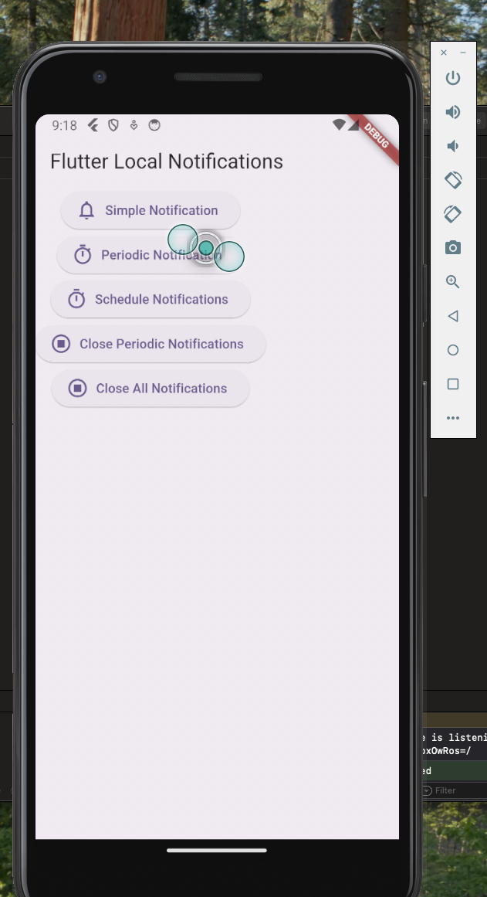

# flutter_local_notifications module usage

- flutter_local_notifications를 사용하여 로컬알림을 동작하는 예제

# android setting reference

- android/build.gradle
- android/app/build.gradle
- android/app/src/main/AndroidManifest.xml

# ios setting reference

- ref: https://github.com/MaikuB/flutter_local_notifications/blob/master/flutter_local_notifications/example/ios/Runner/AppDelegate.swift

- ios/Runner/AppDelegate.swift

  

# modules

- flutter_local_notifications - ref: https://pub.dev/packages/flutter_local_notifications
- flutter timezone - ref: https://pub.dev/packages/timezone
- rxdart - ref: https://pub.dev/packages/rxdart

# preview

